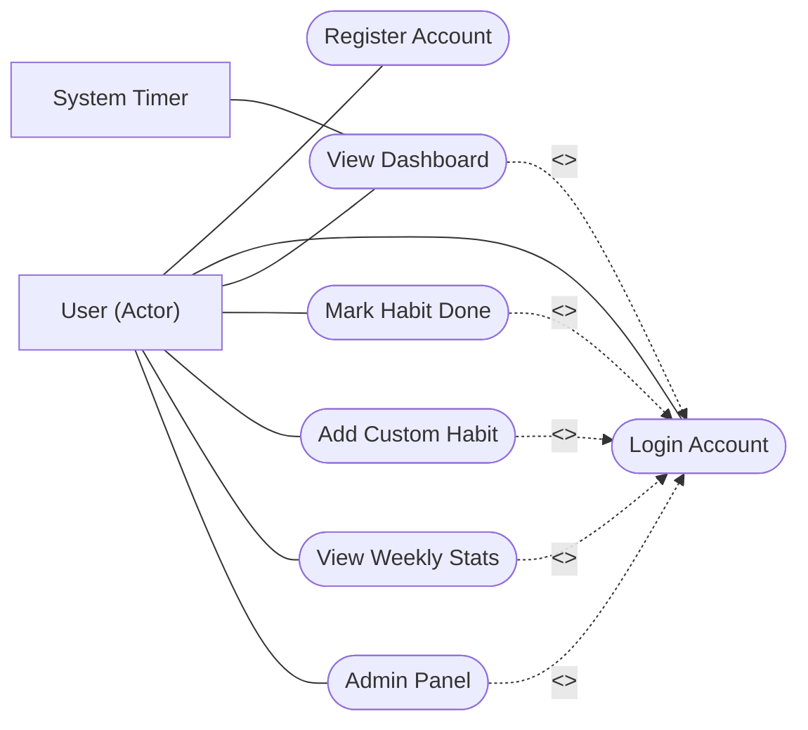
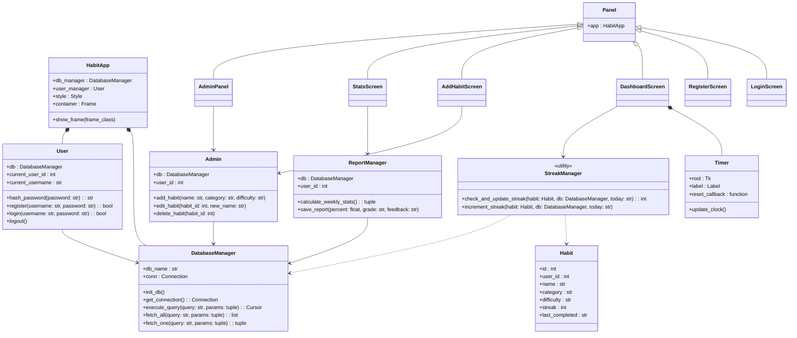
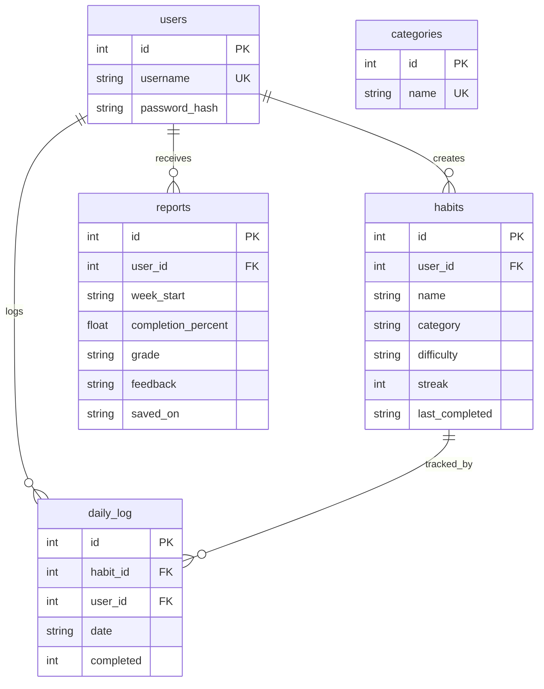
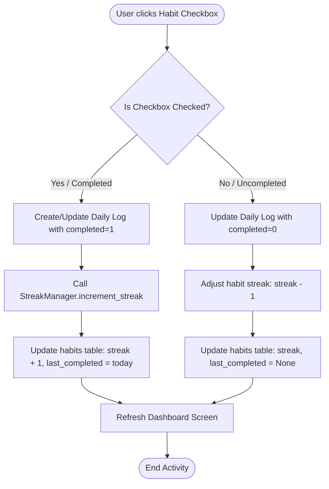
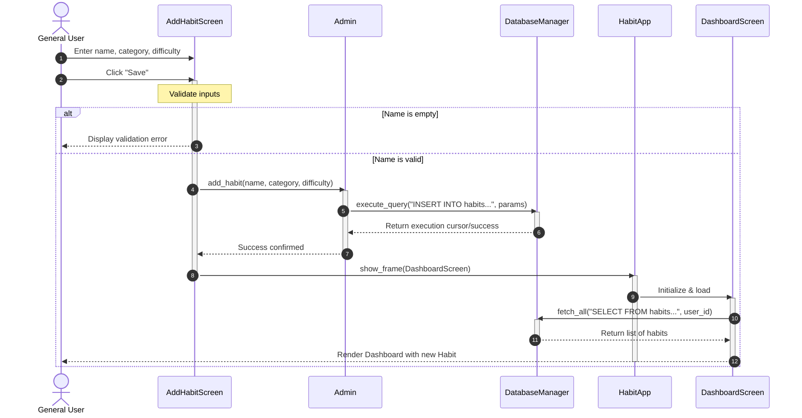

# HabitFlow – UML Diagrams & Architectural Documentation

This document contains a complete set of professional UML diagrams detailing the structure, architecture, and behavior of the **HabitFlow – Daily Habit Tracker** application. All diagrams are built using standard, clear Mermaid syntax with straight connections and appropriate UML arrow conventions.

---

## 1. Use Case Diagram
The Use Case diagram shows the interactions between the **General User**, the automatic **System Timer**, and the core functionalities of the application. The associations are represented by standard straight solid lines, while relationship dependencies use dashed arrow lines labeled with `<<include>>` or `<<extend>>` pointing in the correct UML direction.

---

## 2. Class Diagram
The Class diagram represents the Object-Oriented Programming (OOP) structure of the application. It highlights encapsulation, inheritance (screens inheriting from the base `Panel` class which inherits from `tk.Frame`), and associations between managers and database operations.

---

## 3. Entity Relationship Diagram (ERD)
The ERD shows the SQLite database schema model design, representing primary keys, foreign key constraints, column types, and structural relationship cardinalities.

---

## 4. Activity Diagram
The Activity diagram models the procedural flow and logic that occurs when a user checks/unchecks a habit card checkbox on their dashboard. It utilizes standard straight routing paths.

---

## 5. Sequence Diagram
This Sequence diagram models the chronological process flow and system interactions when a user adds a new habit, validating the inputs, storing them to the database, and updating the dashboard screen.

